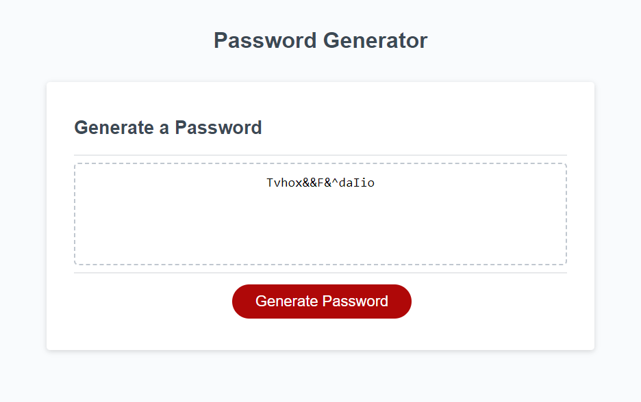

# Password-Generator
Password Generator Project

## Overview

This Password Generator Project is a simple yet powerful tool that allows users to generate strong and secure passwords. With this project, you can easily create unique passwords with varying levels of complexity to enhance the security of your accounts.

## Screenshot

## Deployment

-Deployment Link: https://interuptingcow.github.io/Password-Generator/

## Features

-Randomized Passwords: The password generator uses a strong randomization algorithm to create unpredictable and secure passwords.

-Customizable Parameters: Users can customize various parameters, such as password length, inclusion of uppercase letters, lowercase letters, numbers, and special characters.

-User-Friendly Interface: The project features a clean and intuitive user interface, making it accessible to users of all levels.

## Contributing
Contributions are welcome! If you find any issues or have suggestions for improvements, please open an issue or submit a pull request.

## License
This project is licensed under the MIT License - see the LICENSE file for details.
